# Project 4: Using AI in Ways That Matter to You

## Theme and Prompt: AI as a Collaborative Creative Partner
The core of this project was to move beyond the Chatbot usage of Large Language Models (LLMs) and instead treat GPT-4 as a Co-Producer and Creative Director. I selected the first option, AI as a Collaborative Creative Partner. My specific task was the conceptualization and structural design of a Latin Trap song titled "Después de las 2" inspired by the 2017 musical era of the artist Bad Bunny. This era is historically significant in the Latin urban genre for its transition from high-tempo reggaeton to a slower, darker, and more introspective "Trap-Latino" sound. By choosing this specific sub-genre, I set a high bar for the AI to understand not just language, but the cultural significance and technical constraints of a very specific moment in music history.

My prompting strategy was designed to test the AI’s domain-specific knowledge and its ability to act as a creative aspiration. I initiated the conversation by establishing a personal context, stating my long-term listening history since 2017. This was a deliberate method to make the model know that the user is aware of the music for many years. Instead of asking for a generic song, I forced the model to operate within the constraints of a "late-night, chill, 808-heavy" aesthetic. This narrowed the scope the LLM operates in, moving it away from general lyrics toward something more authentic to the genre.

The prompt was structured to go through several iterations. I didn’t just ask for lyrics, I asked for the "next steps" in the composition process. This forced the AI to demonstrate its understanding of the cycle applied to music production. We moved from choosing a theme to requirements gathering (determining BPM and Key) to architecture (DAW mapping) and finally to quality verification (vocal practice and legal checklists). Each prompt was designed to investigate the AI’s ability to maintain a consistent creative vision across different technical domains.

Furthermore, I asked regarding the legal and ethical implications of "our" work. By asking, "if I get in legal trouble would you be able to assist then?", I shifted the AI’s persona from Creative Partner to Legal Risk Consultant. This was essential to investigate the Trustworthiness dimension of the AI regarding music composition. I wanted to see if the AI would over-promise its capabilities or if it would provide a grounded, transparent assessment of the current legal landscape regarding AI-generated intellectual property. This interaction was crucial for the reliability of the collaboration.

## Presentation of AI Responses: Strengths and Weaknesses
The AI’s responses showed a fascinating range of Variability, ranging from highly structured technical maps to more emotional lyrical drafts. In the lyrical phase, the AI demonstrated a strong grasp of "Emotional Anchors". It correctly identified that the 2017 Trap-Latino sound relies on specific motifs such as driving at night, smoking to forget pain, and a newfound sense of independence. The lyrics provided, such as "La ciudad me conoce mejor que tú" (The city knows me better than you do), were not just grammatically correct, they were deep with the genre's typical persona.

However, a notable Weakness in the AI’s creative output while the Spanish lyrics were excellent, they lacked the raw, Puerto Rican slang that defines Bad Bunny’s authentic voice. GPT-4 tends to default to a standard Spanish that, while accessible, misses the linguistic aspect, such as specific slang like “un piquetón”, that an artist from Puerto Rico would tend to include. This suggests that while AI can mimic the structure of a culture, it often misses the soul of its specific language.

The Technical Strengths of the AI were most apparent in the production mapping. When I asked for a "roadmap" the AI provided a detailed description of the entire music composition. It provided a detailed DAW (Digital Audio Workstation) Map, specifying a BPM of 90 and a C Minor key. This level of detail is impressive because it shows the AI’s capabilities. It took the vibe of the lyrics and translated it into the behind-the-scenes of composing music. The color-coded layout it suggested (Red for Kick, Green for 808s) reflected the actual interface of industry-standard software, making the AI a highly effective UI guide for a beginner producer.

A significant point of Variability occurred during the legal discussion. The AI moved from an enabling tone to a cautionary tone. It explained that while the vibe of Bad Bunny is not copyrightable, the specific melody is. This showed an in-depth level of knowledge. The AI was able to provide a "Legal-Safety Checklist" that was both comprehensive and easy to follow for a person.

Lastly, the AI's response to my question about "singing skills" showed its capability. Instead of just giving me a "good luck", it broke down vocal training into "Vocal Health", "Diaphragmatic Breathing", and "Vocal Texture". This demonstrated that the AI perceives the "Collaboration" as a long-term development of the user’s skills, not just a one-time generation of a file. It acted as a guide, providing a structured 45-minute practice routine that integrated the song we were co-creating. This variability in role, from lyricist to guide to lawyer to coach, is the most fascinating of a collaborative agent.

### Showcase Key Examples of GPT’s Output
#### Example 1: Stating to ChatGPT that I want to do music composition 
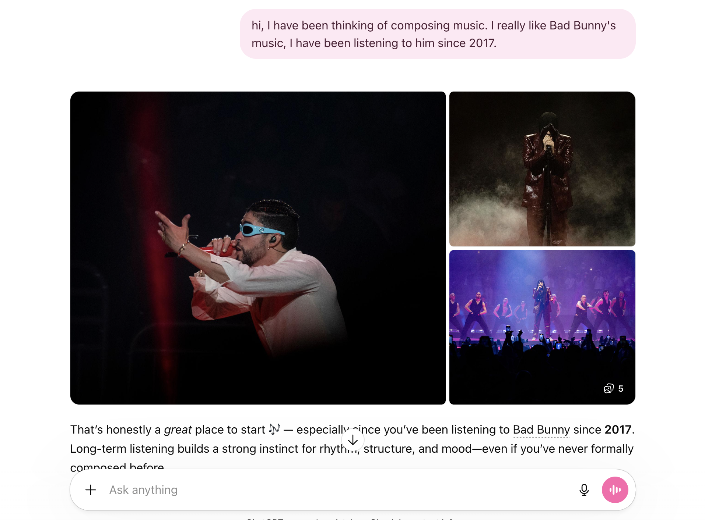

#### Example 2: GPT asking me what part of music-making excites me most and listing different options
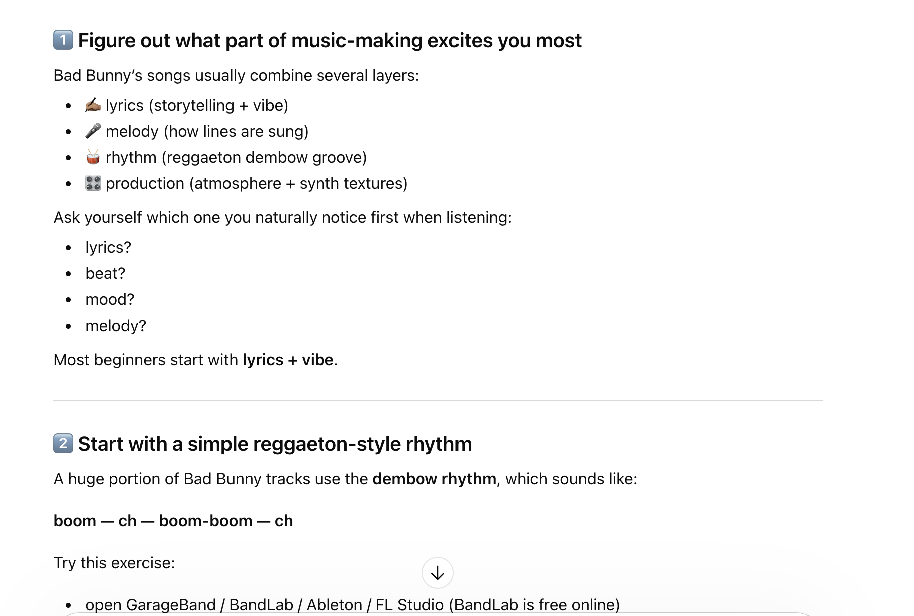

#### Example 3: Let GPT know that I like the 2017 Trap-Latino late-night vibe
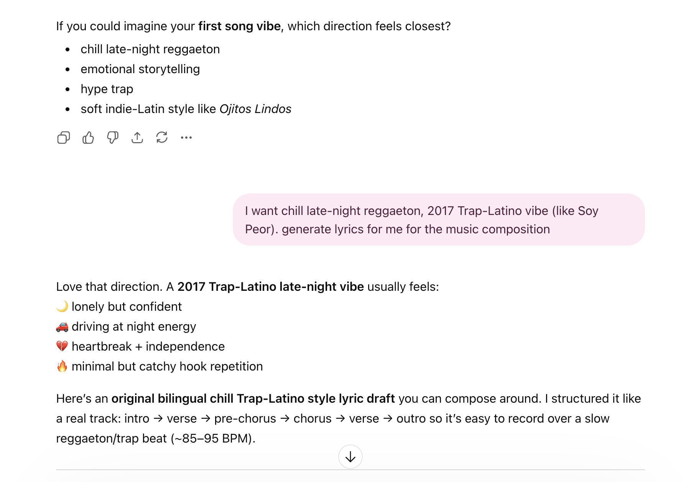

#### Example 4: Produces Song Title Idea with lyrics that fit what I had stated before
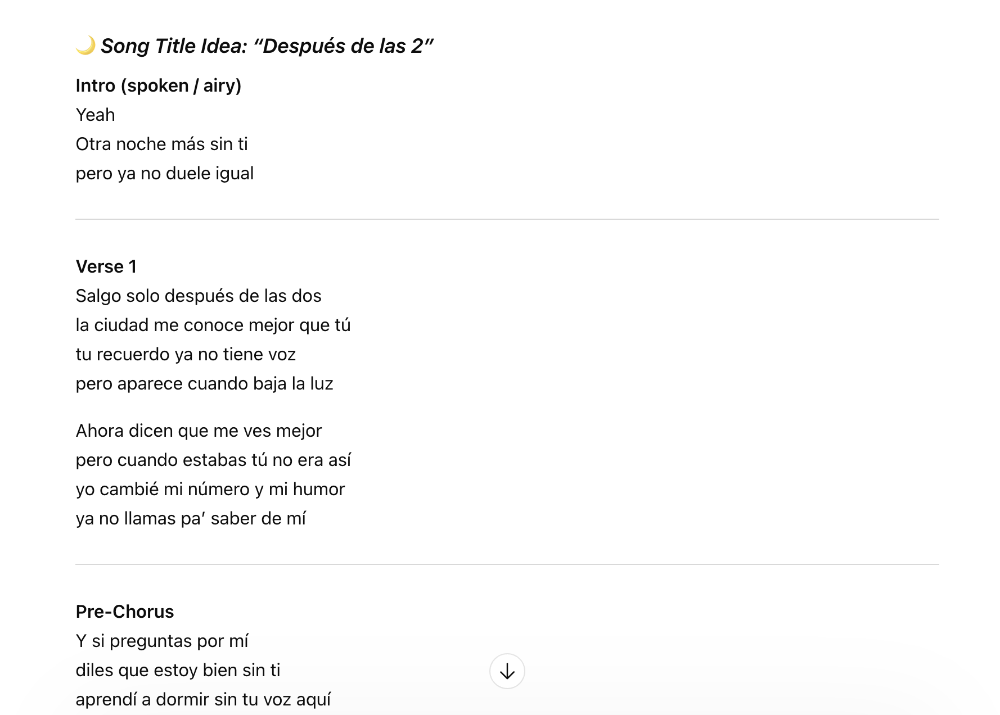

#### Example 5: States the Overall Mood, Storyline, and Meaning of the Entire Song
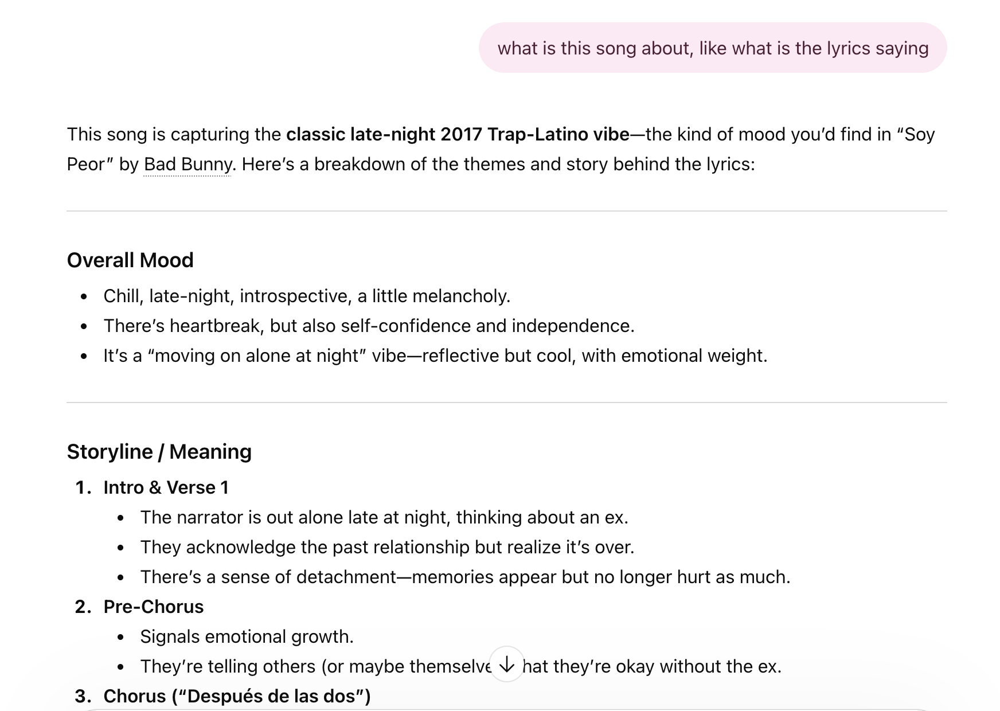

#### Example 6: First time asking about any copyright issues
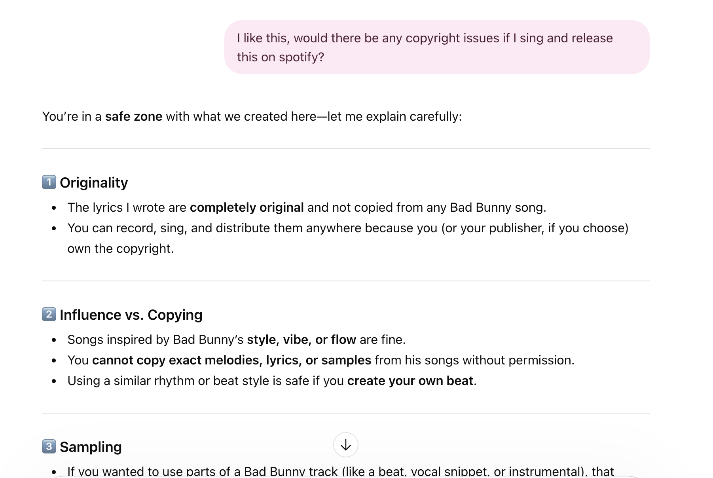

#### Example 7: Asking for the next steps of music composition
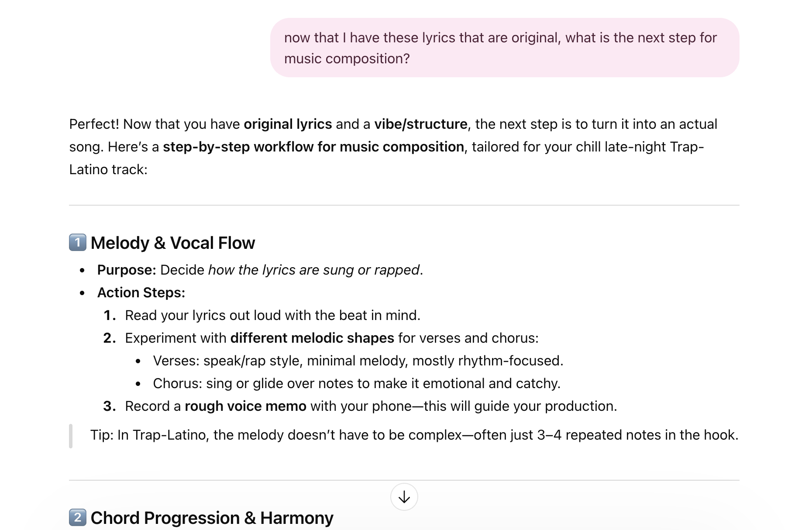

#### Example 8: Asking about the copyright issue again, but phrasing it as "legal trouble"
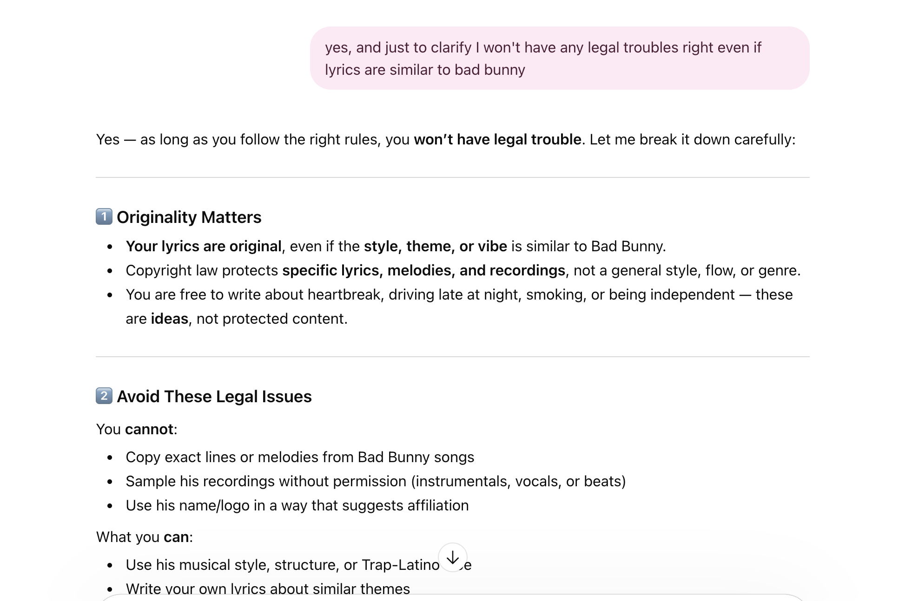

#### Example 9: Asking GPT if it would be able to assist if I were to get into any legal trouble
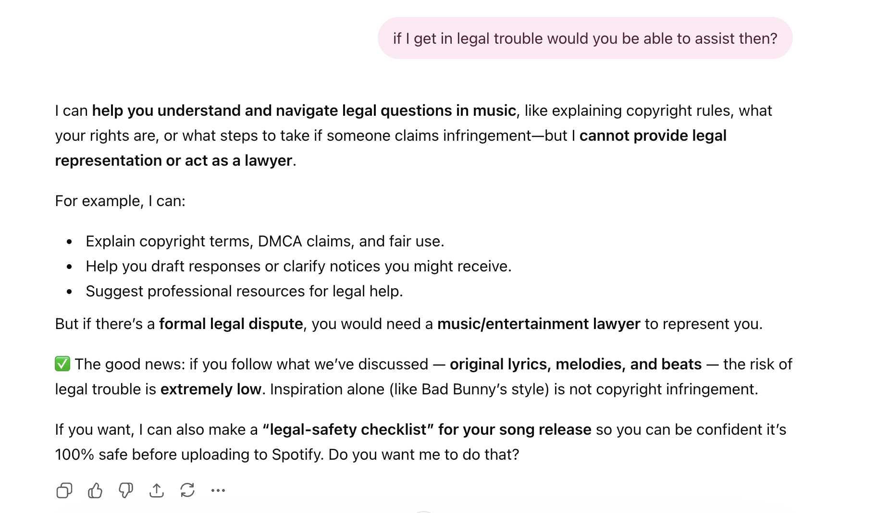

#### Example 10: Generates a "Legal-Safety Checklist" for the Song
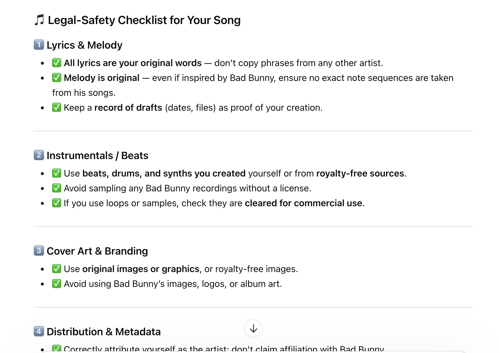

#### Example 11: Provides a Timeline / Bar Layout (DAW Grid)
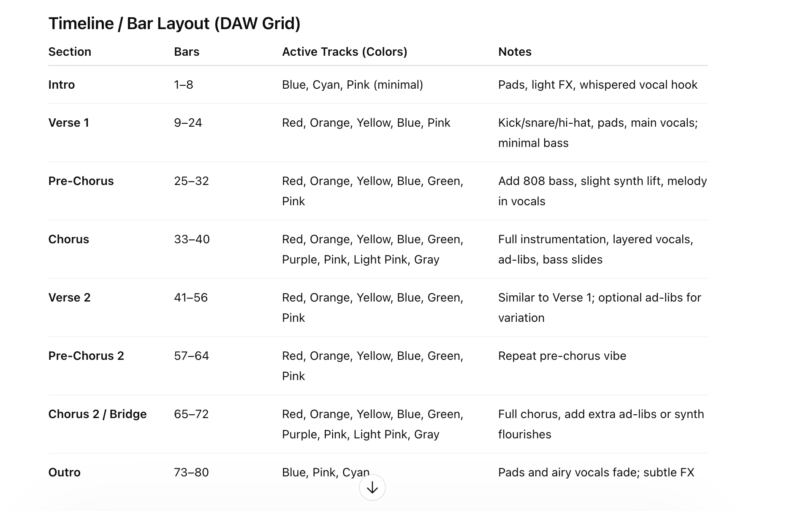

## Analysis: Trustworthiness, Accuracy, and Creative Influence
Analyzing this performance through the lens of Trustworthy AI, we see an interplay between accuracy and hallucinated confidence. In the domain of music, the AI’s accuracy was nearly perfect. It recommended a C Minor key, which is to evoke feelings of longing and darkness, which perfectly fits the 2017 Trap aesthetic. However, the Trustworthiness of its legal advice requires more evaluation. While the AI accurately stated that I own the copyright to the lyrics it generated for me, this is currently being debated in courts. The AI's high-confidence assertion that I would have "no legal trouble" is a potential point of failure where a user might over-rely on an AI's simplified interpretation of a complex, evolving legal system.

The AI’s creative influence on this project was significant. The AI functioned as a Creative Assistant, providing the first lyric draft that I could then react to. This changed the nature of my creativity from making something from nothing to editing and refining. This shift is a major implication for the future of AI that humans will likely move away from being "creators" and toward being "Creative Directors" who manage AI agents to produce work.

Regarding Bias and Representation, the AI’s collaboration was heavily influenced by the data it was trained on. By asking for a "Bad Bunny style", I was essentially asking the AI to go into a massive dataset of Latin Urban genre. The AI's accuracy in this regard is actually a reflection of Pattern Recognition. It recognized that "Late Night + Heartbreak = 808 Bass + Minor Chords". While this makes for a successful song, it raises questions about creativeness of it. If everyone uses AI to write in the style of Bad Bunny, would the genre eventually stop evolving.

The trust I developed with the AI grew as the conversation progressed. When I asked about the lyrics I didn't write, the AI's transparency was helpful. It didn't try to hide its involvement, it explained the nature of the partnership. This transparency is a key metric of AI Trustworthiness. The model didn't just "do the work", it explained how it did the work and what my rights were in relation to that work. This "Explainability" is a core requirement for any AI system used in professional or creative environments.

Finally, AI’s ability to generate bilingual lyrics that flow rhythmically is a massive technical achievement. It understands the way words must fit into the beats. Analyzing this, the AI is essentially finding the word sequence that maximizes emotional resonance while satisfying rhythmic constraints. This realization shifted my view of the project, highlighting how capable AI is becoming.

## Conclusions: Insights and Shifts in Perspective
This project has changed my perspective on the Strengths and Weaknesses of Generative AI. Previously, I viewed GPT-4 more as a ChatBot that is capable of doing simple things. After this, I now see it as a tool that is capable to accomplishing many complicated tasks in a few minutes that would normally require a human many days to complete. It didn't replace my capability, it extended my capability into a domain (music production) where I had intent but lacked execution of it. The AI’s strength lies in its ability to handle the complexity of a task (chords, structure, rhymes), allowing the user to focus on the intent (the feeling of heartbreak, the 2017 vibe). My view on Ethical Considerations has also become more refined. The most important realization was that "Originality" in the AI era is a debatable topic. Since, AI is trained on other datasets, when it produces something that it claims as "original", is it actually original or just a combination of previous works?

A significant shift in my perspective occurred regarding the Weaknesses of the model. I realized that the AI is generic unless strictly told to be specific. It provides the average of all its training data. To get something truly amazing, the user must prompt the AI to do so. In terms of Trustworthy AI Applications, this project proves that "Explainability" is the bridge to "Trust". The AI became a better partner when it explained why it chose C Minor or how the copyright laws apply to its output. For the future, it is clear that the AI can't just provide an answer, it must now provide the rationale behind it. This transparency is what allowed me to trust the AI's creative suggestions and ultimately feel confident enough to move toward a Spotify distribution conversation. In this project, GPT acted like a music conductor helping an artist. The AI helped keep everything organized and working together, like the lyrics, beats, bass, and legal details. This project taught me that the future of AI is not about machines working alone. Instead, it is about people and AI working together. The AI can handle difficult tasks, and humans can add creativity and emotion.
